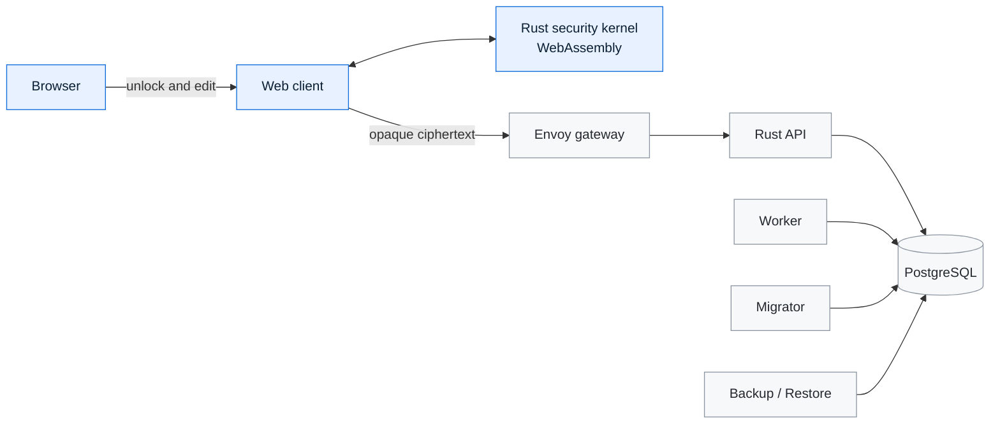

<div align="center">


<h1>Veyora</h1>

<p><strong>Your private digital space.</strong></p>

<p>
  A self-hosted, client-encrypted credential vault built around a portable Rust security kernel.
</p>

<p>
  <a href="https://github.com/Passion-Flow/veyora/actions/workflows/ci.yml"></a>
  <a href="LICENSE"></a>
  <a href="https://www.rust-lang.org/"></a>
  <a href="https://www.docker.com/"></a>
  
</p>

<p>
  <a href="README.md"></a>
  <a href="https://translate.google.com/translate?sl=en&amp;tl=zh-CN&amp;u=https%3A%2F%2Fgithub.com%2FPassion-Flow%2Fveyora"></a>
  <a href="https://translate.google.com/translate?sl=en&amp;tl=zh-TW&amp;u=https%3A%2F%2Fgithub.com%2FPassion-Flow%2Fveyora"></a>
  <a href="https://translate.google.com/translate?sl=en&amp;tl=es&amp;u=https%3A%2F%2Fgithub.com%2FPassion-Flow%2Fveyora"></a>
  <a href="https://translate.google.com/translate?sl=en&amp;tl=fr&amp;u=https%3A%2F%2Fgithub.com%2FPassion-Flow%2Fveyora"></a>
  <a href="https://translate.google.com/translate?sl=en&amp;tl=de&amp;u=https%3A%2F%2Fgithub.com%2FPassion-Flow%2Fveyora"></a>
  <a href="https://translate.google.com/translate?sl=en&amp;tl=ja&amp;u=https%3A%2F%2Fgithub.com%2FPassion-Flow%2Fveyora"></a>
  <a href="https://translate.google.com/translate?sl=en&amp;tl=ko&amp;u=https%3A%2F%2Fgithub.com%2FPassion-Flow%2Fveyora"></a>
  <a href="docs/i18n/README.md"></a>
</p>

<sub>English is the canonical documentation. Language badges open machine-translated views; technical commands and security notices should always be verified against this file.</sub>

</div>

---

Veyora is an experimental credential vault for people who want to keep the
meaning of their data on their own devices. The browser encrypts and decrypts
vault records through a WebAssembly build of the Rust security kernel. The
server stores opaque ciphertext, revisions, and synchronization metadata—it is
not entrusted with plaintext vault contents or root keys.

> [!CAUTION]
> Veyora is a preview, not an audited security product. Do not store real
> credentials or expose it to the public internet without an independent
> cryptographic and deployment review. Start only with inert test data and read
> the [security policy](SECURITY.md).

## What makes Veyora different

| Principle | What it means in this repository |
| --- | --- |
| **Client-side secrecy** | Record encryption, decryption, key derivation, and password generation run in the browser through the Rust/WASM kernel. |
| **Opaque infrastructure** | The API, worker, database, backups, and operational telemetry are designed around ciphertext-only records. |
| **Portable cryptography** | One Rust kernel provides the protocol implementation, deterministic vectors, WASM bindings, and native FFI surfaces. |
| **Explicit operations** | Services fail fast when required configuration is absent; development and production-shaped Compose files are separate. |
| **Recovery-aware design** | Recovery kits, encrypted backups, revision control, and manifest integrity are part of the protocol model rather than afterthoughts. |

## Highlights

- Encrypted record creation, retrieval, update, deletion, and batch operations
- Login, secure-note, API-token, SSH-credential, and digital-identity templates
- Local search, sorting, favorites, clipboard timeout, and automatic vault lock
- Argon2id key derivation, HKDF-SHA-256 domain separation, and
  XChaCha20-Poly1305 authenticated encryption
- Ed25519 authorization, canonical CBOR profiles, and chunked Merkle manifests
- Password generation using OS-backed randomness and rejection sampling
- Recovery-kit encoding with Base32 and checksum validation
- PostgreSQL and in-memory storage adapters with compare-and-set revisions
- Dedicated API, worker, migrator, backup, restore, and sandbox binaries
- Docker Compose topology with Envoy, nginx, PostgreSQL, and a static WASM client
- Corpus-bound known-answer vectors and offline-friendly Rust test suites

## Architecture



The client-side zone handles plaintext and keys. Infrastructure services are
limited to opaque records and operational metadata. See the
[architecture guide](docs/ARCHITECTURE.md) and
[threat model](docs/security/threat-model.md) for the detailed boundaries.

## Quick start

### Requirements

- Docker Engine with Docker Compose
- Git
- A modern browser with WebAssembly support

### Run the local preview

```bash
git clone https://github.com/Passion-Flow/veyora.git
cd veyora
cp .env.example .env
```

Set a unique development database password in `.env`, then start the stack:

```bash
docker compose up --build -d
docker compose ps
```

Open `http://127.0.0.1:3000`. The API gateway is available on
`http://127.0.0.1:8080` for local diagnostics.

To exercise the ciphertext API with inert data:

```bash
./scripts/smoke-test.sh http://127.0.0.1:8080
```

Stop the preview with `docker compose down`. Add `--volumes` only when you
intentionally want to delete the local PostgreSQL volume.

## Develop from source

The repository pins its Rust toolchains in each workspace.
Running every source check also requires Python 3 and Node.js 22. The optional
WASM runtime check requires the `wasm32-unknown-unknown` Rust target and
`wasm-bindgen-cli` 0.2.127.

```bash
# Security kernel
cd security-kernel
cargo test --locked --workspace --all-targets

# Backend
cd ../backend
cargo test --locked --workspace --all-targets
```

Useful root commands:

```bash
make help
make test
make run       # in-memory API on 127.0.0.1:8080
make run-web   # static client on 127.0.0.1:3000
```

See [CONTRIBUTING.md](CONTRIBUTING.md) for the development workflow and
[docs/DEPLOYMENT.md](docs/DEPLOYMENT.md) for the complete configuration and
container workflow.

## Repository map

```text
veyora/
├── backend/           Rust API, persistence, and operational services
├── contracts/         Versioned protocol, schema, and policy definitions
├── deployment/        Gateway and static web-client container sources
├── frontend/spikes/   Native integration probes used by kernel checks
├── security-kernel/   Rust cryptography core, WASM/FFI bindings, and vectors
├── docs/              Architecture, operations, security, and legal guides
└── scripts/           Smoke testing and multi-architecture image publishing
```

## Security model

Veyora is designed so that server-side components do not need plaintext vault
content, master-password material, root keys, or record keys. That design goal
does not remove risks in the browser, endpoint, build chain, deployment, or
recovery process.

- Treat the browser and the device running it as part of the trusted boundary.
- Terminate production TLS at owner-controlled ingress.
- Never expose the preview configuration directly to an untrusted network.
- Keep database credentials, API tokens, backup keys, and signing keys outside
  Git and inject them through an appropriate secret mechanism.
- Independently review cryptographic changes and production configuration.

Please read [SECURITY.md](SECURITY.md) before evaluating the project. Do not
publish vulnerability details or real credentials in a public issue.

## Project status

The repository is an early public preview. Core source, test vectors, backend
services, a WASM web client, and Compose-based local deployment are present.
The project has not completed an independent human cryptographic audit, a
production hardening review, or a stable release process. Interfaces and data
formats may change before a supported release.

## Documentation

- [Architecture](docs/ARCHITECTURE.md)
- [Deployment](docs/DEPLOYMENT.md)
- [API reference](docs/reference/api.md)
- [Threat model](docs/security/threat-model.md)
- [Plaintext and metadata inventory](docs/security/plaintext-metadata-inventory.md)
- [Changelog](CHANGELOG.md)
- [Brand and trademark guidelines](BRAND_GUIDELINES.md)

## License

Veyora is source-available under the
[PolyForm Noncommercial License 1.0.0](LICENSE). It is **not** licensed under an
OSI-approved open-source license. Personal, educational, research, and other
noncommercial uses are permitted subject to the exact license terms;
commercial use is not granted by this repository.

The Veyora name and brand are governed separately by the
[trademark policy](TRADEMARK.md). Third-party components remain subject to their
respective licenses.

<div align="center">
  <sub>Built and maintained by <a href="https://github.com/Passion-Flow">Passion.</a></sub>
</div>
