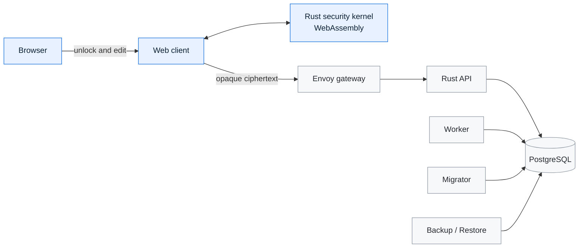

<div align="center">

<!-- Brand mark: black stroke on light, white stroke on dark (GitHub theme-aware). -->
<picture>
  <source media="(prefers-color-scheme: dark)" srcset="apps/web/assets/brand/mark-white.png">
  
</picture>

<h1>Veyora</h1>

<p><strong>Your private digital space.</strong></p>

<p>
  Veyora is being built to help you save, find, and back up passwords and other private information in an encrypted vault you control.
</p>

<p>
  <a href="https://github.com/Passion-Flow/veyora/actions/workflows/ci.yml"></a>
  <a href="LICENSE"></a>
  <a href="https://www.rust-lang.org/"></a>
  <a href="https://www.docker.com/"></a>
  <a href="https://github.com/Passion-Flow/veyora/pkgs/container/veyora-web"></a>
  
  
</p>

<sub>English is the canonical engineering and documentation language.</sub>

</div>

---

Veyora's target product is a desktop-first local Vault for one person whose
default path requires no account or server. That supported product path is not
complete yet. An advanced connected mode is also being developed for people
who operate their own Veyora service.

> [!CAUTION]
> Veyora is a preview, not an audited security product. Do not store real
> credentials or expose it to the public internet without an independent
> cryptographic and deployment review. Start only with inert test data and read
> the [security policy](SECURITY.md).

No Stable download is currently available. Existing packages are unsigned,
unnotarized preview artifacts and have not passed the required four-native
installation matrix.

## What makes Veyora different

| Principle | What it means in this repository |
| --- | --- |
| **Client-side secrecy** | Record encryption, decryption, key derivation, and password generation run in the browser through the Rust/WASM kernel. |
| **Opaque infrastructure** | The API, worker, database, backups, and operational telemetry are designed around ciphertext-only records. |
| **Portable cryptography** | One Rust kernel provides the protocol implementation, deterministic vectors, WASM bindings, and native FFI surfaces. |
| **Explicit operations** | Services fail fast when required configuration is absent; development and production-shaped Compose files are separate. |
| **Evidence before claims** | Capability status comes from a versioned registry; incomplete recovery, packaging, and deployment work is labeled explicitly. |

## Capability status

| Capability | Status | Current boundary |
| --- | --- | --- |
| Rust/WASM record cryptography | Experimental | Fails closed when the real kernel is missing or fails self-test; independent review and release-asset verification remain incomplete |
| Desktop Local Vault | Experimental | Source-development use with inert data only; native packages and recovery are not verified |
| Web Connected Vault | Experimental | Local preview only; production authentication and HTTPS topology are incomplete |
| Login and Secure Note | Experimental | Core create/read/update flows exist; lifecycle, backup, import/export, and accessibility evidence is incomplete |
| Recovery Key | Protocol-only | Current UI material does not recover an existing non-empty Vault in a clean environment |
| Portable encrypted backup | Planned | Existing opaque snapshots are not the promised portable encrypted backup format |
| Four-native signed installers | Unsupported | Signing, notarization, Windows ARM64 packaging, and final-asset validation are incomplete |

The machine-readable source for these statements is
[`release/features.json`](release/features.json). Product version and channel
come from [`release/version.json`](release/version.json).

## Architecture



The client-side zone handles plaintext and keys. Infrastructure services are
limited to opaque records and operational metadata. See the
[architecture guide](docs/ARCHITECTURE.md) and
[threat model](docs/security/threat-model.md) for the detailed boundaries.

## Self-host the experimental connected preview

### Requirements

- Docker Engine with Docker Compose
- Git
- A modern browser with WebAssembly support

### Run the local preview

```bash
git clone https://github.com/Passion-Flow/veyora.git
cd veyora
cp deploy/compose/.env.example deploy/compose/.env
```

Set a unique development database password in `deploy/compose/.env`, then start the
stack:

```bash
cd deploy/compose
docker compose up -d
docker compose ps
```

The default Compose topology references preview `v1.0.0` application and
runtime-foundation images in GitHub Container Registry. Image availability,
digest, and `linux/amd64`/`linux/arm64` coverage must be verified before relying
on those tags; the current repository does not treat every tag as release
evidence.

Open `http://127.0.0.1:3000`. The API gateway is available on
`http://127.0.0.1:8080` for local diagnostics.

To exercise the ciphertext API with inert data (from the repository root):

```bash
./tests/smoke/api.sh http://127.0.0.1:8080
```

Stop the preview with `docker compose down` (from `docker/`). Add `--volumes`
only when you intentionally want to delete the local PostgreSQL volume.

## Desktop development preview

Veyora includes a Tauri desktop implementation for Windows and macOS. It is
the intended default local mode, but it is not a supported Stable package. The
client-encrypted UI and WASM kernel run in the system WebView while the
records API and its SQLite storage run in-process behind a loopback port,
packaged with [Tauri](https://tauri.app):

```bash
make desktop-dev     # run the standalone app from source
make desktop-build   # produce unsigned preview bundles for the current host
```

On first launch the app asks where to store the Vault database. The Vault menu
exposes prototype controls for changing that location, rolling snapshots, and
JSON export/import. An
opaque JSON snapshot is not yet the portable encrypted backup required by the
PRD. Recovery, signing, installation, update, and uninstall evidence remain
incomplete. See the [desktop app guide](docs/DESKTOP.md) for current details.

## Develop from source

The repository pins its Rust toolchains in each workspace.
Running every source check also requires Python 3 and Node.js 22. The optional
WASM runtime check requires the `wasm32-unknown-unknown` Rust target and
`wasm-bindgen-cli` 0.2.127.

```bash
# Security kernel
cd packages/security-kernel
cargo test --locked --workspace --all-targets

# Backend
cd ../backend
cargo test --locked --workspace --all-targets
```

Useful root commands:

```bash
make help
make test
make run       # in-memory API on 127.0.0.1:8080
make run-web   # static client on 127.0.0.1:3000
```

See [CONTRIBUTING.md](CONTRIBUTING.md) for the development workflow and
[docs/DEPLOYMENT.md](docs/DEPLOYMENT.md) for the complete configuration and
container workflow.

## Repository map

```text
veyora/
├── apps/              Shipping applications: web client and desktop client
├── services/          Deployable Rust services: api, worker, migrator, backup, restore, validator
├── packages/          Shared packages: config, contracts-rust, storage adapters
├── contracts/         Versioned protocol, schema, and policy definitions
├── deploy/            Deployment: compose topology, containers, gateway, web, tools
├── experiments/       Archived capability spikes that must not gate releases
├── packages/security-kernel/   Rust cryptography core, WASM/FFI bindings, and vectors
├── docs/              Architecture, operations, security, and legal guides
├── tests/             Browser E2E, smoke, integration, and architecture tests
├── tools/             Repository, web, codegen, and release tooling
└── release/           Version, capability, and progress truth sources
```

## Security model

Veyora is designed so that server-side components do not need plaintext vault
content, master-password material, root keys, or record keys. That design goal
does not remove risks in the browser, endpoint, build chain, deployment, or
recovery process.

- Treat the browser and the device running it as part of the trusted boundary.
- Terminate production TLS at owner-controlled ingress.
- Never expose the preview configuration directly to an untrusted network.
- Keep database credentials, API tokens, backup keys, and signing keys outside
  Git and inject them through an appropriate secret mechanism.
- Independently review cryptographic changes and production configuration.

Please read [SECURITY.md](SECURITY.md) before evaluating the project. Do not
publish vulnerability details or real credentials in a public issue.

## Project status

The repository is an early public preview. Core source, test vectors, backend
services, a WASM web client, and Compose-based local deployment are present.
The project has not completed an independent human cryptographic audit, a
production hardening review, or a stable release process. Interfaces and data
formats may change before a supported release.

## Documentation

- [User guide](docs/USER-GUIDE.md)
- [Operator guide](docs/OPERATOR-GUIDE.md)
- [Desktop client](docs/DESKTOP.md)
- [TLS deployment](docs/DEPLOYMENT-TLS.md)
- [Architecture](docs/ARCHITECTURE.md)
- [Deployment](docs/DEPLOYMENT.md)
- [API reference](docs/reference/api.md)
- [Threat model](docs/security/threat-model.md)
- [Plaintext and metadata inventory](docs/security/plaintext-metadata-inventory.md)
- [Changelog](CHANGELOG.md)
- [Brand and trademark guidelines](docs/brand/BRAND_GUIDELINES.md)

## License

Veyora is source-available under the
[PolyForm Noncommercial License 1.0.0](LICENSE). It is **not** licensed under an
OSI-approved open-source license. Personal, educational, research, and other
noncommercial uses are permitted subject to the exact license terms;
commercial use is not granted by this repository.

The Veyora name and brand are governed separately by the
[trademark policy](docs/legal/TRADEMARK.md). Third-party components remain subject to their
respective licenses.

<div align="center">
  <sub>Built and maintained by <a href="https://github.com/Passion-Flow">Passion.</a></sub>
</div>
