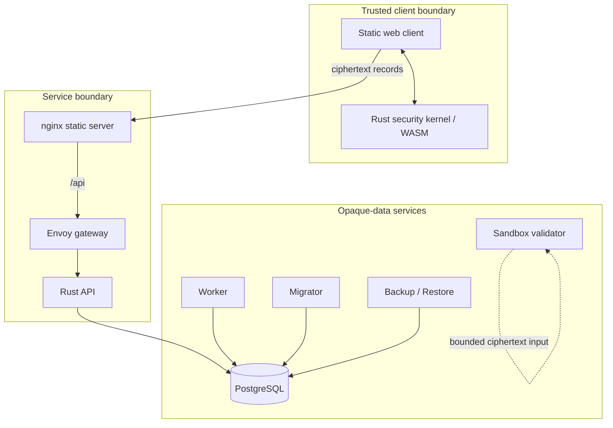

# Architecture

Veyora separates the plaintext-capable client from ciphertext-only
infrastructure. This document describes the source tree as it exists in the
public preview; it is a design and implementation guide, not a security audit.

## System overview

The browser and its WebAssembly module form the plaintext-capable boundary.
Gateway, API, worker, database, backup, and restore paths are designed to handle
opaque protocol records and operational metadata only.

## Components

| Component | Location | Responsibility |
| --- | --- | --- |
| Security kernel | `security-kernel/` | Cryptographic operations, canonical encoding, IDs, session rules, recovery primitives, WASM, FFI, and test vectors |
| Web client | `deployment/web/` | Lock/unlock UX, local record rendering and search, encrypted API requests, and static delivery through nginx |
| Gateway | `deployment/envoy.yaml` and `deployment/Dockerfile.gateway.build` | Explicit API routing and an operator-controlled edge hop; production TLS remains external |
| API | `backend/services/api/` | Ciphertext CRUD, compare-and-set revisions, batch operations, health, readiness, metrics, and optional bearer authentication |
| Persistence | `backend/crates/persistence/`, `backend/crates/postgres/` | Opaque-store interface, in-memory adapter, PostgreSQL adapter, and schema migration |
| Worker | `backend/services/worker/` | Operational polling and tombstone monitoring |
| Migrator | `backend/services/migrator/` | Ordered, idempotent database migrations |
| Backup / Restore | `backend/services/backup/`, `backend/services/restore/` | Logical movement of opaque snapshots |
| Sandbox | `backend/services/sandbox/` | Bounded ciphertext-format validation without database or network access |
| Contracts | `contracts/` | Versioned wire, protocol, configuration, authorization, and policy definitions |

## Record write path

1. The user unlocks the local vault in the browser.
2. The WebAssembly kernel derives key material with Argon2id and HKDF-SHA-256.
3. The kernel creates a random nonce and seals the record with
   XChaCha20-Poly1305 using protocol-bound associated data.
4. The client sends an opaque envelope to the API through nginx and Envoy.
5. The API validates the envelope shape and applies a compare-and-set revision.
6. PostgreSQL stores the opaque record and server-authoritative revision.

The API is not intended to receive the master password, root key, derived record
key, or plaintext template fields.

## Record read path

1. The API returns an opaque record envelope.
2. The browser passes the envelope to the WebAssembly kernel.
3. The kernel authenticates and decrypts the record locally.
4. The client renders the plaintext and applies local-only features such as
   search, sorting, copy timeout, and automatic locking.

## Trust boundaries

| Client-side trusted material | Server-side observable material |
| --- | --- |
| Master password | Opaque ciphertext envelopes |
| Root and derived keys | Record IDs and revisions |
| Plaintext vault fields | Tombstone state and bounded operational metadata |
| Decrypted search index | Request timing, status, and aggregate metrics |
| Recovery secrets | Database and backup object structure |

These boundaries are goals enforced by code structure and tests, but they do
not protect a compromised endpoint, browser, dependency, build, or delivery
path. See [SECURITY.md](../SECURITY.md) and the
[threat model](security/threat-model.md).

## Deployment topology

The local Compose preview binds the web client and gateway to `127.0.0.1`.
nginx serves the client and proxies `/api` to Envoy; Envoy forwards to the API;
the API and worker reach PostgreSQL on the private Compose network.

The repository does not provide automatic public TLS. A reviewed deployment
must place the service behind owner-controlled TLS ingress, use an appropriate
authentication layer, inject secrets outside Git, restrict network exposure,
and independently validate backup and recovery procedures.

## Technology

| Layer | Technology |
| --- | --- |
| Security kernel | Rust, RustCrypto ecosystem, `wasm-bindgen` |
| Backend | Rust, Axum, Tokio, PostgreSQL |
| Wire formats | JSON, canonical CBOR, OpenAPI |
| Web client | HTML, CSS, JavaScript, WebAssembly |
| Edge | nginx and Envoy |
| Local deployment | Docker Compose |
| Automation | GitHub Actions |
